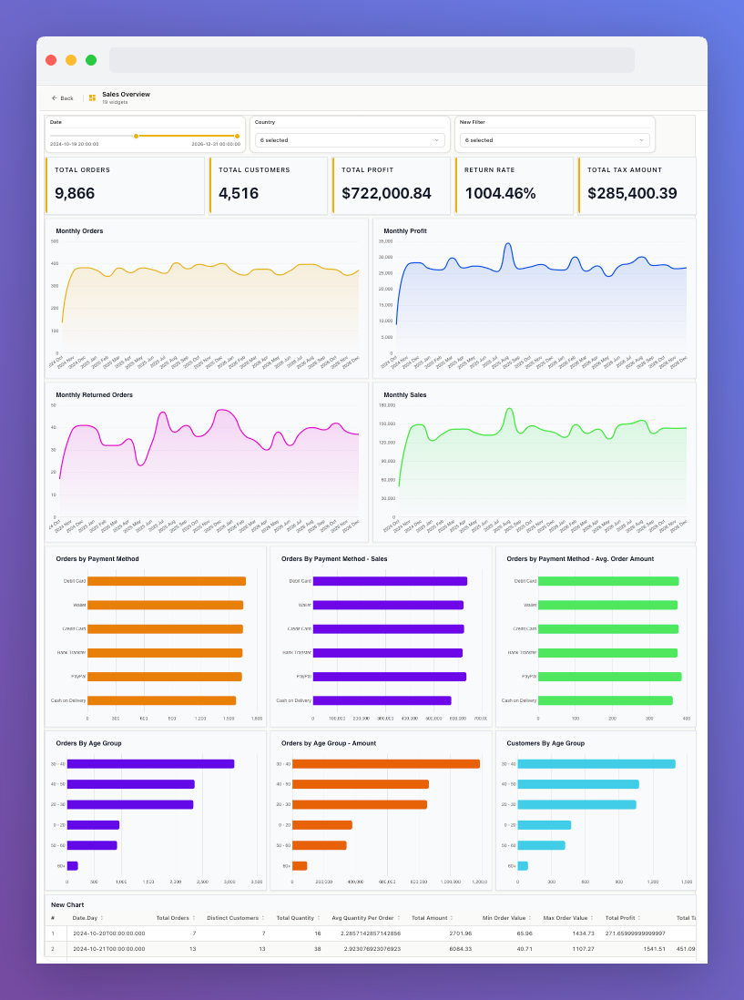
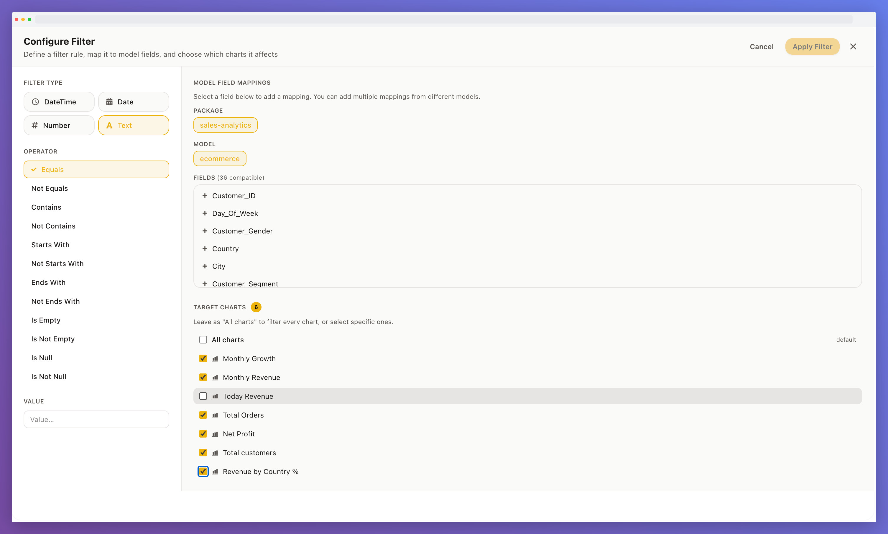

<div align="center">

# Chester BI


**Self-hosted, open-source Business Intelligence platform**

[](LICENSE)
[](https://www.python.org/)
[](https://fastapi.tiangolo.com/)
[](https://react.dev/)
[](https://www.postgresql.org/)
[](https://docs.docker.com/compose/)

[Report a Bug](https://github.com/izzaldeen98/chester-bi/issues) · [Request a Feature](https://github.com/izzaldeen98/chester-bi/issues)

</div>

---

## Table of Contents

- [What is Chester BI?](#what-is-chester-bi)
- [Features](#features)
- [Screenshots](#screenshots)
- [Tech Stack](#tech-stack)
- [Quick Start (Docker — recommended)](#quick-start-docker--recommended)
- [Local Development (without Docker)](#local-development-without-docker)
- [Environment Variables](#environment-variables)
- [Project Structure](#project-structure)
- [API Reference](#api-reference)
- [Contributing](#contributing)
- [License](#license)
- [Acknowledgements](#acknowledgements)

---

## What is Chester BI?

Chester BI is a fully self-hosted business intelligence platform you run on your **own infrastructure**. Connect your databases, model them as [Cube](https://cube.dev/) semantic cubes, build interactive drag-and-drop dashboards, and share insights with your team — with zero vendor lock-in and no data leaving your servers.

> Built on FastAPI, React, PostgreSQL, Redis, and the Cube Core query engine.

---

## Features

- **Connections** — connect to your databases (PostgreSQL, MySQL, Snowflake, BigQuery) or upload CSV files directly
- **Model Editor** — define Cube semantic models with a visual, form-based builder or edit the underlying YAML directly, side by side
- **Dataset Builder** — a drag-and-drop query builder with dimension/measure pickers, filters, and live Table, JSON, Cube query, and generated SQL previews
- **Dashboards** — assemble KPI tiles, charts, and tables on a drag-and-drop canvas, backed by saved datasets
- **Cross-filtering** — configure a single filter, map it to model fields, and apply it across one or many charts at once
- **Access Control** — per-user permissions across connections, models, datasets, and dashboards

---

## Screenshots

<div align="center">



_Dashboards — KPI tiles, charts, and tables wired together with shared date/dimension filters_

<br/>


_Dataset Builder — pick dimensions and measures, filter results, and preview the Table, JSON, Cube query, and generated SQL side by side_

<br/>


_Model Editor — define cubes, dimensions, and measures visually, or edit the generated Cube YAML directly_

<br/>



_Cross-filtering — map a filter to compatible model fields and choose exactly which charts it targets_

</div>

---

## Tech Stack

### Backend
- **[FastAPI](https://fastapi.tiangolo.com/)** + **Uvicorn** — async Python API
- **SQLAlchemy 2** + **PostgreSQL 16** — relational data store
- **[Cube Core](https://github.com/cube-js/cube)** — semantic query engine
- **Redis 7** — query result caching
- **JWT + Bcrypt** — authentication & password hashing
- **Fernet** — encryption for stored connection credentials
- **boto3** — optional AWS S3 file storage

### Frontend
- **React 18** + **TypeScript** + **Vite**
- **React Grid Layout** — drag-and-drop dashboard canvas
- **ECharts / echarts-for-react** — charting library
- **Tailwind CSS** — utility-first styling
- **React Router v6** — client-side routing
- **Nginx** — production static file server + reverse proxy

---

## Quick Start (Docker — recommended)

### Prerequisites
- [Docker](https://docs.docker.com/get-docker/) and [Docker Compose](https://docs.docker.com/compose/install/) installed
- Git

### 1. Clone the repository
```bash
git clone https://github.com/izzaldeen98/chester-bi.git
cd chester-bi
```

### 2. Configure environment variables
```bash
cp .example.env .env
```

Open `.env` and fill in the two **required** secrets:

```bash
# Generate SECRET_KEY
python -c "import secrets; print(secrets.token_hex(32))"

# Generate FERNET_KEY
python -c "from cryptography.fernet import Fernet; print(Fernet.generate_key().decode())"
```

Paste the output into `.env`. All other values have sensible defaults for local development. See [Environment Variables](#environment-variables) for the full reference.

### 3. Start all services
```bash
docker compose up --build
```

This spins up five containers:

| Container | Role | Host Port |
|---|---|---|
| `chester_frontend` | React SPA (Nginx) | **3000** |
| `chester_backend` | FastAPI API | internal |
| `chester_postgres` | PostgreSQL 16 | 5432 |
| `chester_redis` | Redis 7 cache | internal |
| `chester_cube` | Cube Core | internal (4000) |

### 4. Create your account
Open [http://localhost:3000](http://localhost:3000) and click **Get Started** to register your organisation owner account.

---

## Local Development (without Docker)

### Backend

```bash
cd backend
python -m venv .venv
# Windows
.venv\Scripts\activate
# macOS / Linux
source .venv/bin/activate

pip install -r requirements.txt

# Make sure PostgreSQL, Redis, and Cube Core are running, then:
uvicorn main:app --reload --port 8989
```

### Frontend

```bash
cd frontend
npm install
npm run dev        # starts Vite dev server on http://localhost:5173
```

> In dev mode the Vite proxy forwards `/api/*` to `http://localhost:8989`.

---

## Environment Variables

Copy `.example.env` → `.env`. The full annotated reference is in that file. Key variables:

| Variable | Required | Description |
|---|---|---|
| `SECRET_KEY` | **Yes** | JWT signing secret (min 32 chars) |
| `FERNET_KEY` | **Yes** | Fernet key for encrypting DB passwords |
| `ALGORITHM` | No | JWT algorithm (default: `HS256`) |
| `ACCESS_TOKEN_EXPIRE_MINUTES` | No | Session lifetime (default: `180`) |
| `LOCAL_DIR` | No | Local file storage path (default: `./.local/`) |
| `AWS_STORAGE_BUCKET_NAME` | No | S3 bucket — enables S3 storage when set |
| `AWS_REGION` | No | AWS region for S3 |
| `AWS_ACCESS_KEY_ID` | No | AWS access key |
| `AWS_SECRET_ACCESS_KEY` | No | AWS secret key |
| `CUBE_URL` | No | Cube Core base URL (default: `http://localhost:4000`) |
| `CUBEJS_API_SECRET` | **Yes** | Shared secret for signing/verifying the JWT sent to Cube |
| `REDIS_HOST` | No | Redis host (default: `host.docker.internal`) |
| `REDIS_PORT` | No | Redis port (default: `6379`) |
| `REDIS_CACHE_TTL` | No | Cache TTL in seconds (default: `1800`) |
| `POSTGRES_USER` | No | DB username (default: `bi_admin`) |
| `POSTGRES_PASSWORD` | No | DB password (default: `changeme`) |
| `POSTGRES_DB` | No | DB name (default: `bi_db`) |

---

## Project Structure

```
chester-bi/
├── backend/                  # FastAPI application
│   ├── models/               # SQLAlchemy ORM models
│   ├── routes/                # API route handlers
│   ├── schema/                # Pydantic request/response schemas
│   ├── utils/                 # Storage, config, Redis, Cube helpers
│   ├── security.py           # JWT, hashing, encryption
│   ├── main.py                # Application entry point
│   ├── requirements.txt      # Python dependencies
│   └── Dockerfile
├── frontend/                 # React + TypeScript application
│   ├── src/
│   │   ├── components/       # Reusable UI components
│   │   ├── pages/             # Route-level page components
│   │   └── lib/               # API client, auth, theme utilities
│   ├── nginx.conf            # Production Nginx config
│   ├── package.json
│   └── Dockerfile
├── .example.env              # Annotated environment template
├── docker-compose.yml         # Full-stack orchestration
└── LICENSES/                  # Third-party license attributions
```

---

## API Reference

The FastAPI backend ships with interactive API documentation:

| URL | Tool |
|---|---|
| `http://localhost:8989/docs` | Swagger UI |
| `http://localhost:8989/redoc` | ReDoc |

---

## Contributing

Contributions are welcome and appreciated!

1. **Fork** the repository
2. **Create** a feature branch: `git checkout -b feat/my-feature`
3. **Commit** your changes: `git commit -m "feat: add my feature"`
4. **Push** to your branch: `git push origin feat/my-feature`
5. **Open a Pull Request** — describe what you changed and why

Please open an issue first for large changes so we can discuss the approach.

### Code Style
- **Backend**: follow [PEP 8](https://pep8.org/); type-annotate all function signatures
- **Frontend**: ESLint + TypeScript strict mode; Tailwind for styling

---

## License

Distributed under the **MIT License**. See [`LICENSE`](LICENSE) for details.

Chester BI uses **Cube Core** under its own license. See [`LICENSES/LICENSE-THIRD-PARTY`](LICENSES/LICENSE-THIRD-PARTY) for third-party attributions.

---

## Acknowledgements

- [Cube](https://cube.dev/) — the semantic query engine powering Chester BI's query layer
- [FastAPI](https://fastapi.tiangolo.com/) — the backend framework
- [React Grid Layout](https://github.com/react-grid-layout/react-grid-layout) — dashboard drag-and-drop
- [ECharts](https://echarts.apache.org/) — charting library

---

<div align="center">

Made with ❤️ by the Chester BI contributors · [⭐ Star this repo](https://github.com/izzaldeen98/chester-bi)

</div>
